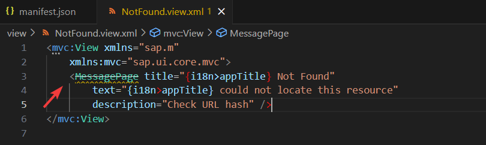
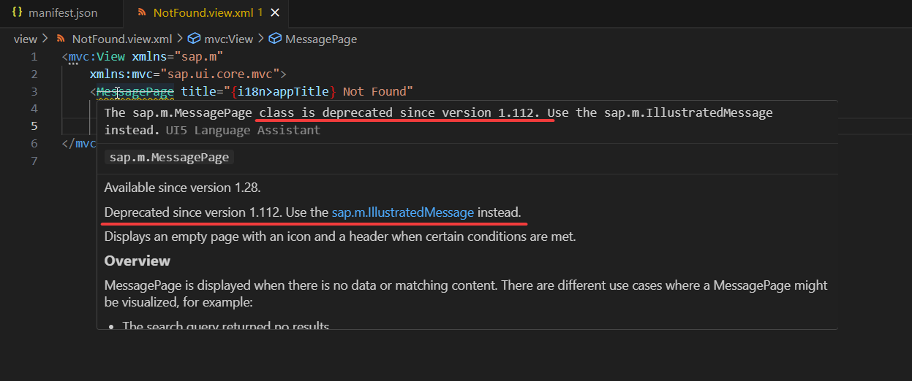

Evite o uso de **controles, propriedades e métodos depreciados**. O SAPUI5 evolui constantemente, e funcionalidades antigas podem deixar de ser suportadas em versões futuras.

### Boas práticas:

-   Sempre verifique a documentação oficial no [SAPUI5 SDK](https://sapui5.hana.ondemand.com/sdk/#/api).
-   Cada API, controle ou propriedade indica claramente se está **@deprecated** e, em muitos casos, aponta a alternativa recomendada.

**Dica:** Tanto o Business Application Studio quanto o VS Code (por meio das extensões do Fiori Tools) indicam problemas dessa natureza:

